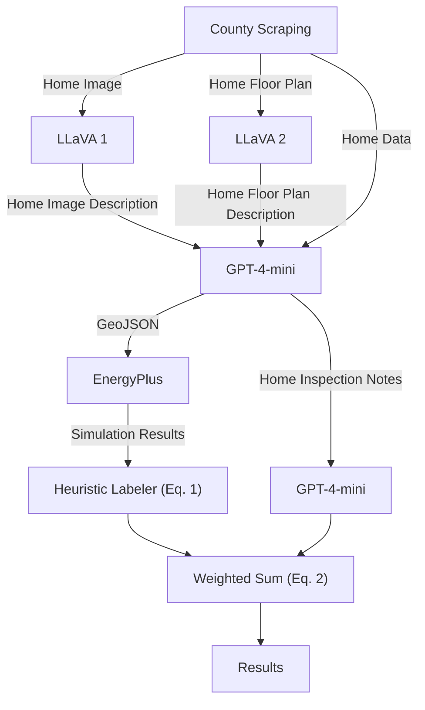

# Urban Energy Data Pipeline

## Overview
This project builds a synthetic dataset for urban energy analysis using publicly available assessor data, AI models (including OpenAI GPT and LLaVA), and simulation tools. The pipeline:

1. **Scrapes** property data and images from streets listed in `STREETS`.
2. **Generates** GeoJSON building footprints and inspection reports via OpenAI's API.
3. **Converts** GeoJSON to IDF format for EnergyPlus simulation.
4. **Runs** EnergyPlus simulations to produce energy performance outputs.
5. **Labels** the simulation outputs and inspection reports using OpenAI's API or heuristics.

Additionally, **occlusion experiments** analyze model sensitivity to localized image changes for robustness analysis.

---

## Publication

Jackson Eshbaugh, Chetan Tiwari, Jorge Silveyra. _A Modular and Multimodal Generative AI Framework for Urban Building Energy Data: Generating Synthetic Homes_. [arXiv:2509.09794](https://arxiv.org/abs/2509.09794).

```bibtex
@misc{eshbaugh2025modularmultimodalgenerativeai,
      title={A Modular and Multimodal Generative AI Framework for Urban Building Energy Data: Generating Synthetic Homes}, 
      author={Jackson Eshbaugh and Chetan Tiwari and Jorge Silveyra},
      year={2025},
      eprint={2509.09794},
      archivePrefix={arXiv},
      primaryClass={cs.AI},
      url={https://arxiv.org/abs/2509.09794}, 
}
```

---

## Pipeline Flow


_Figure 1_: Flow of data through the dataset generation pipeline.

---

## Create Virtual Environment
Create the `venv` that the pipeline will use with the following command:
```bash
python3 -m venv venv

# Activate the environment
source venv/bin/activate
```


## Install dependencies:

1. First, install the base requirements:
```bash
pip install -r requirements.txt
```

2. Then, based on your version of CUDA, install the corresponding CUDA packages:

```bash
# CUDA 11.8
pip install -r requirements_cuda118.txt

# CUDA 12.1
pip install -r requirements_cuda121.txt

# CUDA 12.6
pip install -r requirements_cuda126.txt
```

## Setup environment variables
Copy `.env.example` to `.env` and add your OpenAI API key:
```env
OPENAI_API_KEY=your-api-key-here
```

## Prepare the Labeler

Our labeler uses scalers to determine how to weigh different scores. Here, we prepare these scalers.

```bash
# Build calibration sims
python -m src.pipeline.generate_full_factorial --epw weather/KMSP.epw

# Fit scalers
python -m src.pipeline.build_concept_scaler --concept hvac \
  --sim-var "Electricity:HVAC [J](Hourly)" --sim-stat mean

python -m src.pipeline.build_concept_scaler --concept insulation \
  --sim-var "Heating Coil Heating Energy [J](Hourly)" --sim-stat mean
```

### Run with interactive script
```bash
chmod +x run.sh    # Only once after cloning
./run.sh           # Choose from pipeline, experiments, occlusion
```

Or, run manually:
```bash
python -m src.main --mode pipeline
```

## Requirements
- CUDA
- Python 3.x
- EnergyPlus (with `expandobjects` in `PATH`)
- ChromeDriver for Selenium
- OpenAI API key

---

## Outputs

| $X$ (Input Data) | $Y$ (Ground Truth) |
|------------------|--------------------|
| `dataset/*/results.json` — EnergyPlus simulation results | `dataset/*/label.json` — Data labels $\in \mathbb{R}^2$ |
| `dataset/*/cleaned.geojson["features"][0]["inspection_note"]` — synthetically generated inspection note | |
| `results/final_dataset.jsonl` — all inputs and outputs | `results/final_dataset_summary.csv` — summary statistics |

> **Note**: All outputs are compiled into `final_dataset.jsonl` and `final_dataset_summary.csv` inside the `results/` directory for the entire dataset.


## Experiments

### Occlusion & Reverse Occlusion

Occlusion and reverse occlusion tests are used to evaluate how models process images. Specifically, occlusion measures _necessity_—how important a region of an image is to produce the output—by masking each region of the input and comparing the model's output on this masked image to the output from the unmodified image. This produces a heatmap.

Reverse occlusion (sometimes referred to as inclusion) measures _sufficiency_—if a feature or subset of the input alone leads the model to make the same prediction, then that feature is sufficient for the model’s decision. This testing is performed by masking everything except a given portion of the image and comparing to a baseline, like the above.

### Ablation

In ablation testing, we try to determine importance of each modality that is passed into the model. This is important as the embedders for each type of modality are unique and they need to be balanced with respect to each other. As such, we:

1. Test only text input sensitivity (constant simulation input)
2. Test only simulation input sensitivity (constant text input)
3. Test both inputs together, in a bad/bad, good/bad, bad/good, good/good arrangement.

More details can be found in `experiments.md`.
