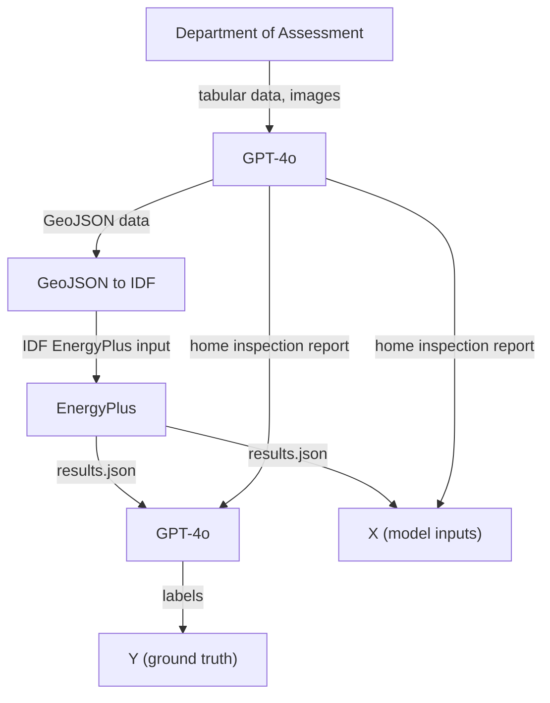

# Urban Energy Data Pipeline

## Overview
This project builds a synthetic dataset for urban energy analysis using publicly available assessor data, AI models (including OpenAI GPT and LLaVA), and simulation tools. The pipeline:

1. **Scrapes** property data and images from streets listed in `STREETS`.
2. **Generates** GeoJSON building footprints and inspection reports via OpenAI's API.
3. **Converts** GeoJSON to IDF format for EnergyPlus simulation.
4. **Runs** EnergyPlus simulations to produce energy performance outputs.
5. **Labels** the simulation outputs and inspection reports using OpenAI's API or heuristics.

Additionally, **occlusion experiments** analyze model sensitivity to localized image changes for robustness analysis.

---

## Pipeline Flow


_Figure 1_: Flow of data through the dataset generation pipeline.

---

## Outputs

| $X$ (Input Data) | $Y$ (Ground Truth) |
|------------------|--------------------|
| `dataset/*/results.json` — EnergyPlus simulation results | `dataset/*/label.json` — Data labels $\in \mathbb{R}^2$ |
| `dataset/*/cleaned.geojson["features"][0]["inspection_note"]` — synthetically generated inspection note | |

> **Note**: All outputs are compiled into `final_dataset.jsonl` and `final_dataset_summary.csv` for the entire dataset.

---

## Running the Project
Ensure you have your `.env` file set up with your `OPENAI_API_KEY`.

### Install dependencies:
```bash
pip install -r requirements.txt
```

### Run the pipeline or experiments:
```bash
python main.py --mode pipeline
```

**Available modes**:
- `pipeline`: Full data generation pipeline
- `experiments`: Run energy labeling experiments
- `occlusion`: Run occlusion experiments (HVAC, Roof, LLaVA)

Example:
```bash
python main.py --mode occlusion
```

Optional flags for pipeline mode:
- `--skip-scrape`
- `--skip-geometry`
- `--end-after-scrape`

---

## Requirements
- Python 3.x
- EnergyPlus (with `expandobjects` in `PATH`)
- ChromeDriver for Selenium
- OpenAI API key

---
