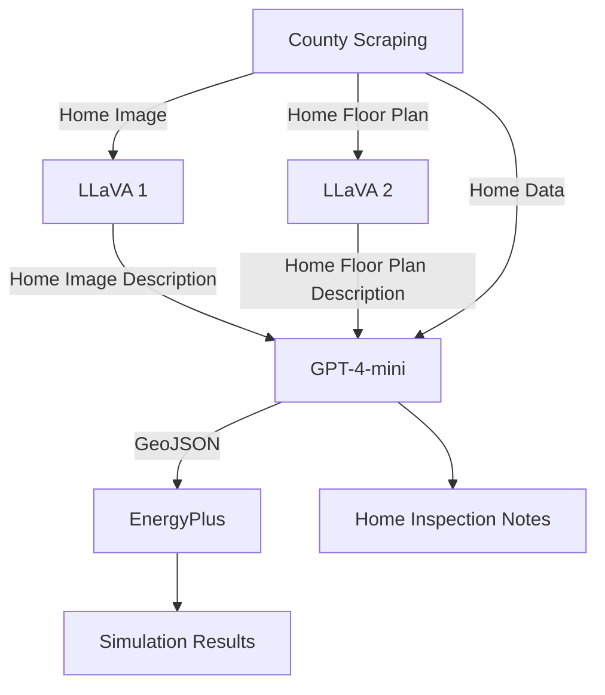

# Synthetic Homes

## Overview
This project builds a synthetic dataset for urban energy analysis using publicly available assessor data, AI models (including OpenAI GPT and LLaVA), and simulation tools. The pipeline:

1. **Scrapes** property data and images from streets listed in `STREETS`.
2. **Generates** GeoJSON building footprints and inspection reports via OpenAI's API.
3. **Converts** GeoJSON to IDF format for EnergyPlus simulation.
4. **Runs** EnergyPlus simulations to produce energy performance outputs.

Additionally, **occlusion experiments** analyze model sensitivity to localized image changes for robustness analysis.

---

## Publications

Jackson Eshbaugh, Chetan Tiwari, Jorge Silveyra, “Synthetic homes: A multimodal generative AI pipeline for residential building data generation under data scarcity”,
_Machine Learning with Applications_, Volume 25, 2026. **DOI:** [10.1016/j.mlwa.2026.100959](https://doi.org/10.1016/j.mlwa.2026.100959)

```bibtex
@article{Eshbaugh2026Synthetic,
title = {Synthetic homes: A multimodal generative AI pipeline for residential building data generation under data scarcity},
journal = {Machine Learning with Applications},
volume = {25},
pages = {100959},
year = {2026},
issn = {2666-8270},
doi = {https://doi.org/10.1016/j.mlwa.2026.100959},
url = {https://www.sciencedirect.com/science/article/pii/S2666827026001246},
author = {Jackson Eshbaugh and Chetan Tiwari and Jorge Silveyra},
}
```

**Note**: We are continuing work on this pipeline and developing tools that can be used to enhance it. Stay posted for additional publications as we continue this work. We will list them below as they appear.

---

## Pipeline Flow


```mermaid
graph TD
  A["County Scraping"] --Home Image--> B["LLaVA 1"]
  A --Home Floor Plan--> C["LLaVA 2"]
  B --Home Image Description--> D["GPT-4-mini"]
  C --Home Floor Plan Description--> D
  A --Home Data--> D
  D --GeoJSON--> E[EnergyPlus]
  D --> F["Home Inspection Notes"]
  E --> G["Simulation Results"]
```
_Figure 1_: Flow of data through the dataset generation pipeline.

---

## Create Virtual Environment
Create the `venv` that the pipeline will use with the following command:
```bash
python3 -m venv venv

# Activate the environment
source venv/bin/activate
```

## Install dependencies:

1. First, install the base requirements:
```bash
pip install -r requirements.txt
```

2. Then, based on your version of CUDA, install the corresponding CUDA packages:

```bash
# CUDA 11.8
pip install -r requirements_cuda118.txt

# CUDA 12.1
pip install -r requirements_cuda121.txt

# CUDA 12.6
pip install -r requirements_cuda126.txt
```

## Setup environment variables
Copy `.env.example` to `.env` and add your OpenAI API key:
```env
OPENAI_API_KEY=your-api-key-here
```

## Running the Pipeline

### Option 1: Run with interactive script
```bash
chmod +x run.sh    # Only once after cloning
./run.sh           # Choose from pipeline, pipeline-no-scrape, occlusion
```

### Option 2: Run manually:
```bash
# <mode> is either "pipeline", "pipeline-no-scrape", or "occlusion". Each of these correspond to an option in the main menu (`run.sh`)
python3 src/main.py --mode <mode>
```

Option 2 is useful for running tasks in the background, as option 1 requires user input to select an option.

## Requirements
- CUDA
- Python 3.x
- EnergyPlus (with `expandobjects` in `PATH`)
- ChromeDriver for Selenium
- OpenAI API key

---

## Outputs

- **Individual (Per Synthetic Home):**
  - EnergyPlus simulation results (`dataset/*/results.json`)
  - Synthetically generated inspection note (`dataset/*/cleaned.geojson["features"][0]["inspection_note]`)
- **Full Dataset**: `results/final_dataset.jsonl`, `results/final_dataset_summary.csv`

> **Note**: All outputs are compiled into `final_dataset.jsonl` and `final_dataset_summary.csv` inside the `results/` directory for the entire dataset.
---

## Experiments

### Occlusion & Reverse Occlusion

Occlusion and reverse occlusion tests are used to evaluate how models process images. Specifically, occlusion measures _necessity_—how important a region of an image is to produce the output—by masking each region of the input and comparing the model's output on this masked image to the output from the unmodified image. This produces a heatmap.

Reverse occlusion (sometimes referred to as inclusion) measures _sufficiency_—if a feature or subset of the input alone leads the model to make the same prediction, then that feature is sufficient for the model’s decision. This testing is performed by masking everything except a given portion of the image and comparing to a baseline, like the above.